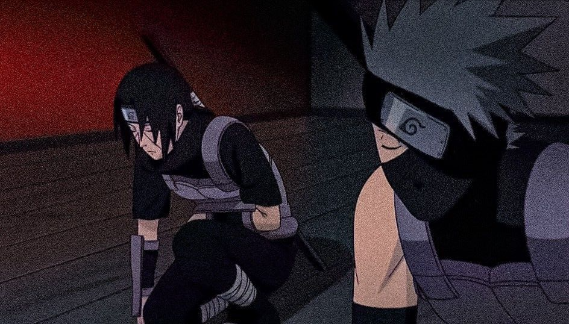

## &nbsp;***About me***

I am systems and Computer Engineering student at Universidad Nacional de Colombia.
* **I am interested in Web designing, Android development, and digital marketing**
- 🌱 I’m currently learning ...
  - Java
  - React js
- 👯 I’m looking forward to collaborate on open source projects.
- ✔ Ask me about anything, I am happy to help, only if the ball is in my court!😉 
- Outside tech, 📖 I love to read novels, 🖌️ do painting and skecthing, 🎵 listen to music, and 🌴 explore nature outdoors.
- 📫 Reach out to me at: <a href="bhargavi.kurukunda@students.iiit.ac.in">bhargavi.kurukunda@students.iiit.ac.in</a>

## My Skills 🪄
- **Programming Languages**

     
  </a>

- **Front-end**

    
    
    
    
  </a>

- **Back-end**

    
    
  </a>

- **Database**

    
    
  </a>

- **Operating system**

    
    
  </a>

- **System, Networking & Deployment**

    
  </a>

- **Terminal Scripts**

    
  </a>

- **Tools**

    
  </a>

## My Stats 🪄

<!-- Copy-paste in your Readme.md file -->

<a href="https://next.ossinsight.io/widgets/official/compose-user-dashboard-stats?user_id=128399569" target="_blank" style="display: block" align="center">
  <picture>
    <source media="(prefers-color-scheme: dark)" srcset="https://next.ossinsight.io/widgets/official/compose-user-dashboard-stats/thumbnail.png?user_id=128399569&image_size=auto&color_scheme=dark" width="771" height="auto">
    
  </picture>
</a>

<!-- Made with [OSS Insight](https://ossinsight.io/) -->

  

## 💎 Proyectos Destacados
-  **Ponderati** A group project where students can leave comments and ratings about teachers, allowing others to know their strengths and weaknesses before enrolling in their courses. In this way, students can make more informed decisions when choosing their teachers.

<!-- Copy-paste in your Readme.md file -->

  

<!-- Made with [OSS Insight](https://ossinsight.io/) -->

  ![Visits Badge]

¡Gracias por visitar mi perfil! 😊
