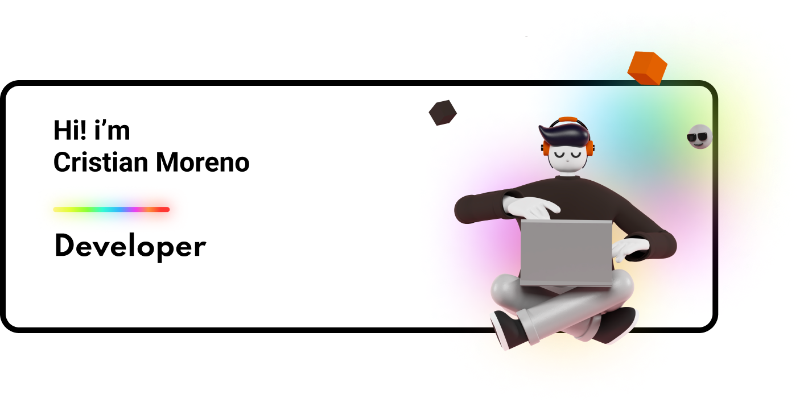

## About me
Systems and Computer Engineering student at Universidad Nacional de Colombia.

## My Skills 🪄
- **Programming Languages**

     
  </a>

- **Front-end**

    
    
    
    
  </a>

- **Back-end**

    
    
  </a>

- **Database**

    
    
  </a>

- **Operating system**

    
    
  </a>

- **System, Networking & Deployment**

    
  </a>

- **Terminal Scripts**

    
  </a>

- **Tools**

    
  </a>

<!-- Copy-paste in your Readme.md file -->

<a href="https://next.ossinsight.io/widgets/official/compose-user-dashboard-stats?user_id=128399569" target="_blank" style="display: block" align="center">
  <picture>
    <source media="(prefers-color-scheme: dark)" srcset="https://next.ossinsight.io/widgets/official/compose-user-dashboard-stats/thumbnail.png?user_id=128399569&image_size=auto&color_scheme=dark" width="771" height="auto">
    
  </picture>
</a>

<!-- Made with [OSS Insight](https://ossinsight.io/) -->

## 💎 Proyectos Destacados
-  **Ponderati** A group project where students can leave comments and ratings about teachers, allowing others to know their strengths and weaknesses before enrolling in their courses. In this way, students can make more informed decisions when choosing their teachers.

<!-- Copy-paste in your Readme.md file -->

<a href="https://next.ossinsight.io/widgets/official/compose-activity-trends?repo_id=877103730" target="_blank" style="display: block" align="center">
  <picture>
    <source media="(prefers-color-scheme: dark)" srcset="https://next.ossinsight.io/widgets/official/compose-activity-trends/thumbnail.png?repo_id=877103730&image_size=auto&color_scheme=dark" width="815" height="auto">
    
  </picture>
</a>

<!-- Made with [OSS Insight](https://ossinsight.io/) -->

                           
                       

¡Gracias por visitar mi perfil! 😊
